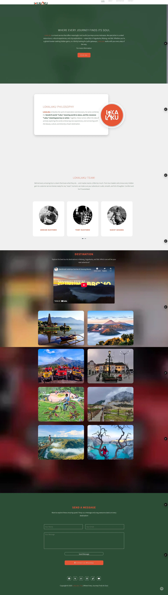

# LokaLaku Trip - Website Perjalanan Wisata

### Where Every Journey Finds Its Soul

[](https://lokalaku.vercel.app/)
[](https://opensource.org/licenses/MIT)

Ini adalah repositori untuk kode sumber website LokaLaku Trip, sebuah platform layanan perjalanan yang dirancang untuk menawarkan perjalanan yang penuh makna dan berkesan di seluruh Indonesia.


*(Catatan: Disarankan untuk menambahkan screenshot homepage website Anda di sini)*

## 📜 Tentang Proyek

**LokaLaku** adalah website statis yang responsif dan menarik secara visual, dibangun untuk memamerkan berbagai paket wisata di Indonesia, dengan fokus pada destinasi seperti Yogyakarta, Malang, dan Bali. Nama "LokaLaku" berasal dari gabungan kata Sansekerta **"Loka"** (dunia/tempat) dan kata Jawa **"Laku"** (perjalanan/tindakan), yang mencerminkan filosofi untuk secara aktif menjelajahi dunia dan terhubung dengan keindahan, budaya, serta keragaman setiap destinasi.

Website ini berfungsi sebagai halaman arahan (landing page) untuk menarik calon pelanggan, memberikan informasi detail tentang paket wisata, dan menyediakan cara mudah untuk menghubungi tim melalui WhatsApp atau formulir kontak.

**🔗 Live Demo:** [**https://lokalaku.vercel.app/**](https://lokalaku.vercel.app/)

## ✨ Fitur Utama

-   **Desain Responsif:** Tampilan yang optimal di berbagai perangkat, mulai dari desktop hingga ponsel.
-   **Navigasi Halaman Tunggal:** Pengalaman pengguna yang mulus dengan navigasi *smooth-scrolling*.
-   **Galeri Destinasi Interaktif:** Tampilan paket wisata dalam format grid dengan efek hover yang menarik.
-   **Detail Paket dalam Modal:** Jendela pop-up (modal) yang menampilkan informasi rinci setiap paket, lengkap dengan *slideshow* gambar.
-   **Profil Tim:** Bagian "Tentang Kami" yang memperkenalkan anggota tim LokaLaku dengan tautan media sosial mereka.
-   **Video Tersemat:** Menampilkan video sinematik dari YouTube untuk menarik perhatian pengunjung.
-   **Formulir Kontak Fungsional:** Terintegrasi dengan [Formspree](https://formspree.io/) untuk pengiriman pesan yang mudah.
-   **Integrasi WhatsApp:** Tombol ajakan (call-to-action) yang langsung mengarahkan pengguna ke obrolan WhatsApp untuk pemesanan.
-   **Animasi Halus:** Menggunakan WOW.js untuk menganimasikan elemen saat digulir (scroll).
-   **SEO-Friendly:** Dilengkapi dengan meta tag yang relevan untuk optimasi mesin pencari.

## 🛠️ Teknologi yang Digunakan

| Kategori            | Teknologi                                                                                                  |
| ------------------- | ---------------------------------------------------------------------------------------------------------- |
| **Frontend** | `HTML5`, `CSS3`, `JavaScript (ES6)`                                                                        |
| **Framework & Perpustakaan** | `Bootstrap 3`, `jQuery`, `Vegas.js`, `Owl Carousel 2`, `WOW.js`, `Animate.css`, `Font Awesome 6` |
| **Layanan & Alat** | `Formspree` (untuk formulir kontak), `Google Fonts`, `Google AdSense`, `Vercel` (untuk hosting)             |

## 🚀 Cara Menjalankan Proyek Secara Lokal

Untuk menjalankan proyek ini di mesin lokal Anda, ikuti langkah-langkah berikut:

1.  **Clone repositori ini:**
    ```bash
    git clone [https://github.com/username/nama-repo.git](https://github.com/username/nama-repo.git)
    ```

2.  **Masuk ke direktori proyek:**
    ```bash
    cd nama-repo
    ```

3.  **Buka file `index.html`:**
    Cukup buka file `index.html` di browser favorit Anda.
    ```bash
    # Pada Windows
    start index.html

    # Pada macOS
    open index.html

    # Pada Linux
    xdg-open index.html
    ```

    Untuk pengalaman pengembangan terbaik, disarankan menggunakan ekstensi **Live Server** di Visual Studio Code untuk melihat perubahan secara *real-time*.

## 📂 Struktur Proyek

````

.
├── css/                \# Berisi semua file CSS (Bootstrap, Owl Carousel, style kustom)
├── images/             \# Berisi semua gambar dan aset visual
├── js/                 \# Berisi semua file JavaScript (jQuery, Bootstrap, skrip kustom)
├── index.html          \# File HTML utama
├── thank-you.html      \# Halaman setelah pengiriman formulir
└── README.md           \# File ini

```

## 📞 Kontak

Jika Anda tertarik untuk berkolaborasi atau memiliki pertanyaan, jangan ragu untuk menghubungi kami:

-   **Instagram:** [@lokalaku_trip](https://www.instagram.com/lokalaku_trip/)
-   **WhatsApp:** [+62 813-3142-1031](https://wa.me/6281331421031)
-   **Email:** Kirim pesan melalui [formulir kontak](https://lokalaku.vercel.app/#contact) di website.

## 📄 Lisensi

Proyek ini dilisensikan di bawah Lisensi MIT. Lihat file `LICENSE` untuk detail lebih lanjut.

---
Dibuat dengan ❤️ oleh tim LokaLaku.
